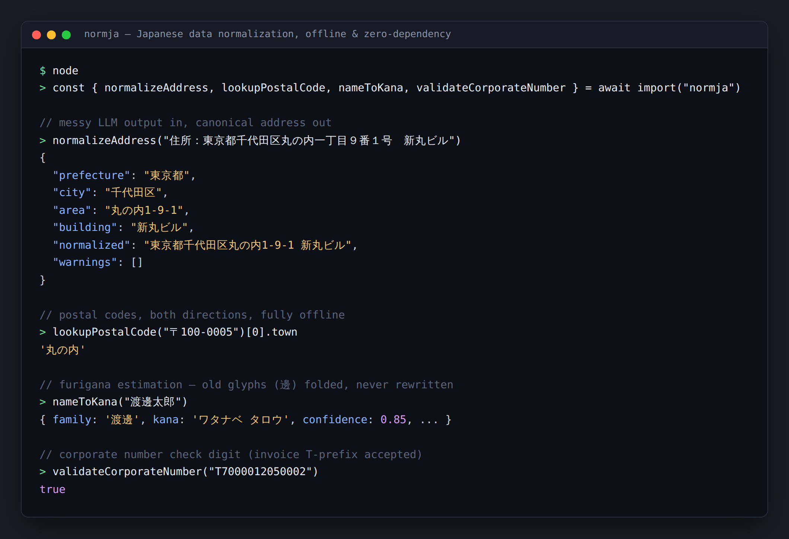
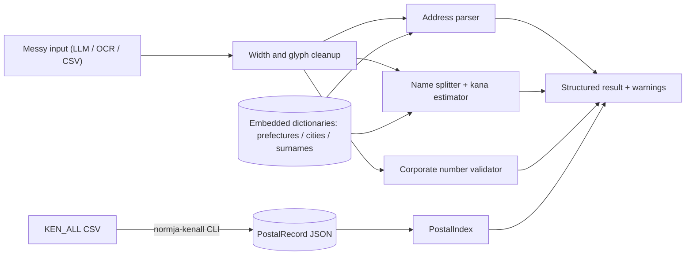

# normja

[English](README.md) | [中文](README.zh.md) | [日本語](README.ja.md)

[](LICENSE)

**オープンソースかつ offline-first の日本語データ正規化ツールキット。住所・氏名・郵便番号・法人番号を一括で扱います。**



```bash
# not yet on npm — pack from a checkout of this repository
npm install && npm run build && npm pack
npm install /path/to/normja/normja-0.1.0.tgz  # inside your own project
```

## なぜ normja なのか

日本の住所には唯一の正規表記がありません。東京都千代田区丸の内一丁目9番1号 と 丸の内1-9-1 は同じ場所ですが、漢数字と算用数字、全角と半角、都道府県の有無が自由に混在します。LLM でフィールド抽出を行うようになってからは、「住所：」のようなラベルや旧字体まで含んだ乱れたデータがこれまで以上の速度で流れ込みます。既存のオープンソースは住所のジオコーディングに特化しており、郵便番号検索は有料 API、氏名の読み推定は各自の経験頼みで、日本向けプロダクトの開発チームは同じ後処理層を毎回作り直しています。

|  | normja | normalize-japanese-addresses | Postal code API SaaS |
|---|---|---|---|
| カバー範囲 | addresses + postal codes + names + corporate numbers | addresses (geocoding) | postal codes |
| インストール後のオフライン動作 | yes | no (fetches dictionary data at runtime by default) | no (hosted API) |
| 氏名かな / 法人番号対応 | yes | no | no |
| ライセンス / 費用 | MIT, free | MIT, free | commercial |

## 特徴

- **LLM 出力を前提とした設計** — 「住所：」ラベル、全角数字、漢数字、かっこ、旧字体を拒否せず解析します。
- **完全オフライン・依存ゼロ** — import 時も実行時もネットワークアクセスはありません。辞書はすべて同梱され、各ルールのコメントに根拠を記載しています。
- **郵便番号の双方向検索** — 番号から住所へ、住所から番号へ。日本郵便の公式 KEN_ALL データはコマンド 1 つで変換できます。
- **推測を隠さない設計** — 補完はすべて `warnings` に記録され、氏名の読みには confidence が付きます。誤った読みを返すより null を返します。
- **法人番号チェック** — 公式のチェックディジットアルゴリズムを実装し、インボイス登録番号の "T" プレフィックス形式にも対応しています。
- **型定義完備・tree-shaking 対応** — strict TypeScript、ESM ファースト、副作用のないモジュール構成です。

## クイックスタート

1. インストール:

```bash
# not yet on npm — pack from a checkout of this repository
npm install && npm run build && npm pack
npm install /path/to/normja/normja-0.1.0.tgz  # inside your own project
```

2. `example.mjs` を作成します:

```js
import { normalizeAddress, lookupPostalCode, nameToKana, validateCorporateNumber } from "normja";

console.log(normalizeAddress("東京都千代田区丸の内一丁目９番１号").normalized);
// => 東京都千代田区丸の内1-9-1
console.log(lookupPostalCode("〒100-0005")[0]?.town);
// => 丸の内
console.log(nameToKana("渡邊太郎").kana);
// => ワタナベ タロウ
console.log(validateCorporateNumber("7000012050002"));
// => true
```

3. 実行します:

```bash
node example.mjs
```

出力:

```text
東京都千代田区丸の内1-9-1
丸の内
ワタナベ タロウ
true
```

この例はテスト（`tests/readme-example.test.ts`）でそのまま検証されているため、README と実際の挙動が乖離することはありません。

## 郵便番号フルデータ

同梱の郵便番号データは、デモとテスト用の小さなサンプル（主要な町域 31 件の実在レコード）です。全国データが必要な場合は、日本郵便の郵便番号ダウンロードページから `utf_ken_all.zip` を取得・解凍し、オフラインで一度だけ変換してください:

```bash
npx normja-kenall utf_ken_all.csv > postal.json
```

```js
import { PostalIndex } from "normja";
import { readFileSync } from "node:fs";

const index = new PostalIndex(JSON.parse(readFileSync("postal.json", "utf8")));
index.byCode("530-0001");
index.byAddress("大阪市北区梅田");
```

長すぎる町域名の行分割、「以下に掲載がない場合」の擬似町域、かっこ内の丁目範囲、半角カナといった KEN_ALL 特有の癖はコンバータ側で処理されます。

## アーキテクチャ



## ロードマップ

- [x] 耐障害性のある住所パーサ、郵便番号双方向検索、氏名かな推定、法人番号チェック（テスト 74 件）
- [ ] KEN_ALL 変換済みフルデータの npm データパッケージ公開
- [ ] デジタル庁アドレス・ベース・レジストリ由来の町域辞書
- [ ] 推定した読みの Hepburn ローマ字変換
- [ ] 和暦（令和/平成）の日付正規化

## コントリビューション

コントリビューションを歓迎します。詳細は [CONTRIBUTING.md](CONTRIBUTING.md) を参照してください。変更を送る前に `npm install && npm run build` と `npm test` を実行してください。

## ライセンス

[MIT](LICENSE)
