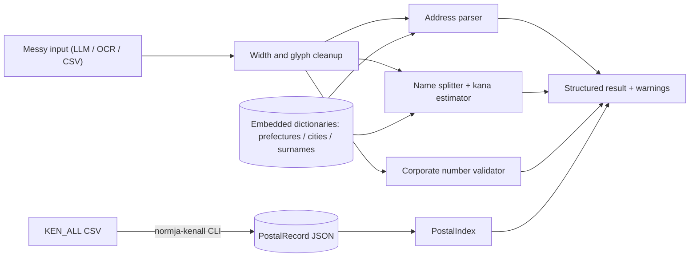

# normja

[English](README.md) | [中文](README.zh.md) | [日本語](README.ja.md)

[](LICENSE)

**An open-source, offline-first toolkit for normalizing Japanese addresses, names, postal codes and corporate numbers.**


```bash
# not yet on npm — pack from a checkout of this repository
npm install && npm run build && npm pack
npm install /path/to/normja/normja-0.1.0.tgz  # inside your own project
```

## Why normja?

Japanese addresses have no single canonical spelling: 東京都千代田区丸の内一丁目9番1号 and 丸の内1-9-1 are the same place, written in kanji numerals or Arabic, full-width or half-width, with or without the prefecture. Since teams started extracting these fields with LLMs, the mess arrives faster than ever — label prefixes, mixed widths and old glyph forms included. Existing open-source tools cover address geocoding only; postal lookup is usually a paid API, and furigana estimation is folklore, so every Japan-market team rebuilds the same cleanup layer.

|  | normja | normalize-japanese-addresses | Postal code API SaaS |
|---|---|---|---|
| Coverage | addresses + postal codes + names + corporate numbers | addresses (geocoding) | postal codes |
| Offline after install | yes | no (fetches dictionary data at runtime by default) | no (hosted API) |
| Name kana / corporate number support | yes | no | no |
| License / cost | MIT, free | MIT, free | commercial |

## Features

- **Built for LLM output** — label prefixes (住所：), full-width digits, kanji numerals, brackets and old glyph forms are parsed, not rejected.
- **Fully offline, zero dependencies** — no network calls at import or runtime; dictionaries are embedded, and every rule is commented with its source.
- **Bidirectional postal lookup** — code to address and address to code, plus a one-command converter for the official Japan Post KEN_ALL dataset.
- **No silent guesses** — every inference lands in `warnings`, and name readings carry a confidence score instead of a wrong answer.
- **Corporate number validation** — the official check-digit algorithm, including the invoice registration "T" prefix format.
- **Typed and tree-shakeable** — strict TypeScript, ESM-first, side-effect-free modules.

## Quickstart

1. Install:

```bash
# not yet on npm — pack from a checkout of this repository
npm install && npm run build && npm pack
npm install /path/to/normja/normja-0.1.0.tgz  # inside your own project
```

2. Create `example.mjs`:

```js
import { normalizeAddress, lookupPostalCode, nameToKana, validateCorporateNumber } from "normja";

console.log(normalizeAddress("東京都千代田区丸の内一丁目９番１号").normalized);
// => 東京都千代田区丸の内1-9-1
console.log(lookupPostalCode("〒100-0005")[0]?.town);
// => 丸の内
console.log(nameToKana("渡邊太郎").kana);
// => ワタナベ タロウ
console.log(validateCorporateNumber("7000012050002"));
// => true
```

3. Run it:

```bash
node example.mjs
```

Output:

```text
東京都千代田区丸の内1-9-1
丸の内
ワタナベ タロウ
true
```

This exact example is covered verbatim by a test (`tests/readme-example.test.ts`), so the README cannot drift from real behavior.

## Full postal dataset

The built-in postal dataset is a small sample (31 real records covering well-known districts) so the library works out of the box for demos and tests. For nationwide coverage, download `utf_ken_all.zip` from the Japan Post postal code download page, unzip it, and convert it once — offline:

```bash
npx normja-kenall utf_ken_all.csv > postal.json
```

```js
import { PostalIndex } from "normja";
import { readFileSync } from "node:fs";

const index = new PostalIndex(JSON.parse(readFileSync("postal.json", "utf8")));
index.byCode("530-0001");
index.byAddress("大阪市北区梅田");
```

The converter handles the KEN_ALL quirks for you: continuation rows split by over-long town names, catch-all pseudo towns, parenthesized chome ranges and half-width kana.

## Architecture



## Roadmap

- [x] Fault-tolerant address parser, bidirectional postal lookup, name kana estimation and corporate number validation (74 tests)
- [ ] npm data package with the full converted KEN_ALL dataset
- [ ] Town-level dictionaries built from the Digital Agency Address Base Registry
- [ ] Hepburn romanization for estimated name readings
- [ ] Japanese era date (令和/平成) normalization

## Contributing

Contributions are welcome — see [CONTRIBUTING.md](CONTRIBUTING.md). Build with `npm install && npm run build` and run the tests with `npm test` before sending a change.

## License

[MIT](LICENSE)
