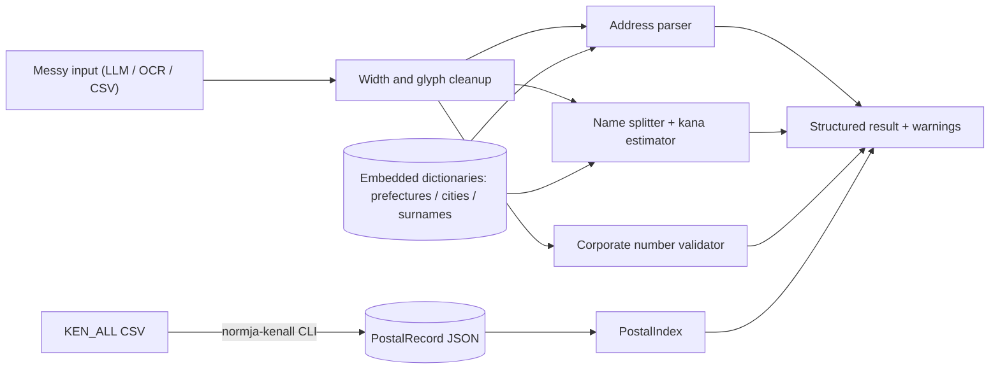

# normja

[English](README.md) | [中文](README.zh.md) | [日本語](README.ja.md)

[](LICENSE)

**开源、offline-first 的日本数据规范化工具箱：住所、氏名、邮政编码、法人番号一站式清洗。**


```bash
# not yet on npm — pack from a checkout of this repository
npm install && npm run build && npm pack
npm install /path/to/normja/normja-0.1.0.tgz  # inside your own project
```

## 为什么是 normja？

日本住所没有唯一的规范写法：東京都千代田区丸の内一丁目9番1号 和 丸の内1-9-1 是同一个地方，可能用汉数字或阿拉伯数字、全角或半角、带或不带都道府县。自从各团队用 LLM 抽取这些字段以来，脏数据来得比以往更快——还夹带「住所：」前缀、混合宽度和旧字体。现有开源工具只覆盖住所地理编码；邮政编码查询通常是付费 API，氏名读音推定则各凭经验，于是每个日本市场团队都在重复造同一层清洗逻辑。

|  | normja | normalize-japanese-addresses | Postal code API SaaS |
|---|---|---|---|
| 覆盖范围 | addresses + postal codes + names + corporate numbers | addresses (geocoding) | postal codes |
| 安装后离线可用 | yes | no (fetches dictionary data at runtime by default) | no (hosted API) |
| 氏名假名 / 法人番号支持 | yes | no | no |
| 许可证 / 费用 | MIT, free | MIT, free | commercial |

## 特性

- **为 LLM 输出而生**——「住所：」前缀、全角数字、汉数字、引号括号、旧字体统统能解析，而不是直接报错。
- **完全离线、零依赖**——import 与运行期都不发网络请求；词典全部内置，每条规则的注释都标明依据。
- **邮政编码双向查询**——编码到住所、住所到编码，另附一条命令即可转换日本邮便官方 KEN_ALL 数据集。
- **不做无声的猜测**——每次推断都会写入 `warnings`，氏名读音附带置信度，宁可返回空也不给错误答案。
- **法人番号校验**——实现官方校验位算法，兼容发票登录番号的 "T" 前缀格式。
- **类型完备、可摇树**——严格 TypeScript、ESM 优先、模块零副作用。

## 快速开始

1. 安装：

```bash
# not yet on npm — pack from a checkout of this repository
npm install && npm run build && npm pack
npm install /path/to/normja/normja-0.1.0.tgz  # inside your own project
```

2. 创建 `example.mjs`：

```js
import { normalizeAddress, lookupPostalCode, nameToKana, validateCorporateNumber } from "normja";

console.log(normalizeAddress("東京都千代田区丸の内一丁目９番１号").normalized);
// => 東京都千代田区丸の内1-9-1
console.log(lookupPostalCode("〒100-0005")[0]?.town);
// => 丸の内
console.log(nameToKana("渡邊太郎").kana);
// => ワタナベ タロウ
console.log(validateCorporateNumber("7000012050002"));
// => true
```

3. 运行：

```bash
node example.mjs
```

输出：

```text
東京都千代田区丸の内1-9-1
丸の内
ワタナベ タロウ
true
```

这个示例被测试原样覆盖（`tests/readme-example.test.ts`），README 与真实行为不会漂移。

## 完整邮政编码数据

内置的邮政编码数据是一份小型样本（31 条真实记录，覆盖知名町域），保证开箱即可演示与测试。若需要全国数据，请从日本邮便的邮政编码下载页获取 `utf_ken_all.zip`，解压后离线转换一次即可：

```bash
npx normja-kenall utf_ken_all.csv > postal.json
```

```js
import { PostalIndex } from "normja";
import { readFileSync } from "node:fs";

const index = new PostalIndex(JSON.parse(readFileSync("postal.json", "utf8")));
index.byCode("530-0001");
index.byAddress("大阪市北区梅田");
```

转换器替你处理 KEN_ALL 的各种坑：超长町域名拆行、「以下に掲載がない場合」占位行、括号内的丁目范围、半角假名。

## 架构



## 路线图

- [x] 容错住所解析、邮政编码双向查询、氏名假名推定、法人番号校验（74 个测试）
- [ ] 发布包含完整 KEN_ALL 转换数据的 npm 数据包
- [ ] 基于デジタル庁 Address Base Registry 构建町域级词典
- [ ] 氏名读音的 Hepburn 罗马字转换
- [ ] 日本年号日期（令和/平成）规范化

## 参与贡献

欢迎贡献——参见 [CONTRIBUTING.md](CONTRIBUTING.md)。提交改动前请运行 `npm install && npm run build` 与 `npm test`。

## 许可证

[MIT](LICENSE)
